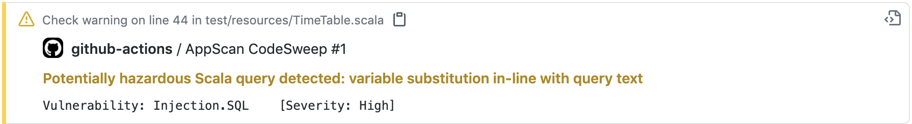
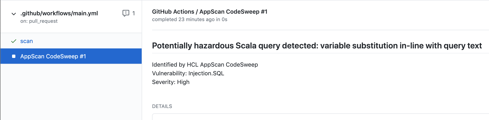

# HCL AppScan CodeSweep Github Action
Stop insecure code from ever reaching your repository with the HCL AppScan CodeSweeep Github Action. When added to a new or existing Github Workflow, this action runs a security scan against all modified and added lines of code. Vulnerable lines of code are annotated with information to help the developer resolve the problem. Invoke the action on pull requests so both the developer and the reviewer are made aware of the problem before the code is ever merged to the repository.

# Usage
1. Register for a free trial of HCL AppScan on Cloud (ASoC) at https://www.hcltechsw.com/appscan/freetrial. Note that this is only necessary to generate your API key/secret.
2. After logging into ASoC, go to https://cloud.appscan.com/main/settings to generate your API key/secret pair. These can be used in the asoc_key and asoc_secret parameters for the action. It's recommended to store them as secrets in your repository.
3. Add the following file to your repository under .github/workflows/main.yml or add to an existing workflow file:
```yaml
on: [pull_request]
jobs:
  scan:
    runs-on: ubuntu-latest
    steps:
      - name: Checkout
        uses: actions/checkout@v1
      - name: Run AppScan CodeSweep
        uses: HCL-TECH-SOFTWARE/appscan-codesweep-action@v1
        with:
          asoc_key: ${{secrets.ASOC_KEY}}
          asoc_secret: ${{secrets.ASOC_SECRET}}
    env: 
      GITHUB_TOKEN: ${{secrets.GITHUB_TOKEN}}
```

# Examples
Annotations are added to the diff view, showing any vulnerable lines of code:


A checkrun is added to provide additional details, including good and bad code samples and mitigation information:

