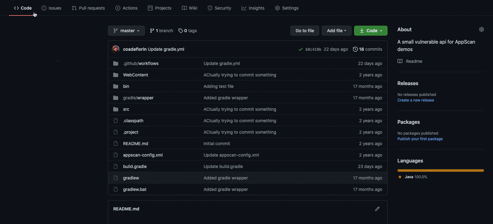

# HCL AppScan CodeSweep Github Action
Your GitHub code is better and more secure with HCL AppScan CodeSweep for GitHub. For free.

The HCL AppScan CodeSweep GitHub Action enables you to check your code on every pull request. The action identifies vulnerabilities in changed code with every update. But more than just identifying issues, the HCL AppScan CodeSweep GitHub Action tells you what you need to know to mitigate issues — before they make it to the main branch.

# Usage
1. Ensure that the "Workflow permissions" for your repository are set to "Read and write permissions". This allows Codesweep to scan your files and create checkruns and annotations for the issues it finds. You can access these settings by going to Settings -> Actions -> General.
2. To scan code changes when a pull request is opened, add the following file to your repository under .github/workflows/codesweep.yml or update an existing workflow file:
```yaml
name: "HCL AppScan CodeSweep"
on:
  pull_request:
    types: [opened,synchronize]
jobs:
  scan:
    runs-on: ubuntu-latest
    steps:
      - name: Checkout
        uses: actions/checkout@v4
        with:
          fetch-depth: 0
      - name: Run AppScan CodeSweep
        uses: HCL-TECH-SOFTWARE/appscan-codesweep-action@v2.1
    env: 
      GITHUB_TOKEN: ${{secrets.GITHUB_TOKEN}}
```
**Note** If you use **checkout@v2** or later you must set fetch-depth to 0. For example:
```yaml
uses: actions/checkout@v2
with:
  fetch-depth: 0
```
# Optional
You can publish security issues to ASoC or AppScan 360 when a pull request is merged. To do so:

1. (ASoC only) Register on [HCL AppScan on Cloud (ASoC)](https://www.hcltechsw.com/appscan/codesweep-for-github) to generate your API key/secret.
2. After logging into ASoC or AppScan 360, go to [the API page](https://cloud.appscan.com/main/settings) to generate your API key/secret pair. These must be used in the asoc_key and asoc_secret parameters for the action. It's recommended to store them as secrets in your repository.
   
3. Add the following file to your repository under .github/workflows/codesweep_publish.yml or update an existing workflow file:
```yaml
name: "HCL AppScan CodeSweep"
on:
  pull_request:
    types: [closed]
jobs:
  publish:
    runs-on: ubuntu-latest
    steps:
      - name: Publish issues to ASoC
        uses: HCL-TECH-SOFTWARE/appscan-codesweep-action@v2.1
        with:
          asoc_key: ${{secrets.ASOC_KEY}}
          asoc_secret: ${{secrets.ASOC_SECRET}}
          publish_on_merge: true
          application_id: <your ASoC application ID>
    env: 
      GITHUB_TOKEN: ${{secrets.GITHUB_TOKEN}}
```
# Optional Parameters For Scanning
- status - The status of the checks if any security issues are found. Must be one of 'action_required', 'failure', or 'neutral'. The default is neutral. For example:
```yaml
with:
  status: failure
```
- service_url - The url of the AppScan service when connecting to AppScan 360.
- acceptssl - Allow connections to an AppScan service with an untrusted certificate. Recommended for testing purposes only.
# Optional Parameters For Publishing Issues to ASoC or AppScan 360
- service_url - The url of your AppScan 360 instance. This is required for connections to AppScan 360. Defaults to ASoC (https://cloud.appscan.com).
- issue_status - The status of issues that are published to ASoC. Must be one of 'open', 'inprogress', 'noise', 'fixed', or 'passed'. The default is 'open'.
- scan_base_name - The base name of the scan for issues published to ASoC. A timestamp is appended to the given base name. The default is 'GitHub_CodeSweep'.
- personal_scan - When issues are published to ASoC, the scan representing those issues can be made a [personal scan](https://help.hcltechsw.com/appscan/ASoC/appseccloud_scans_personal.html). The default is false.
```yaml
with:
  publish_on_merge: true
  application_id: 6c058381-17ca-e711-8de5-002590ac753d
  issue_status: "inprogress"
  scan_base_name: "CodeSweep"
  personal_scan: true
```

# Examples
Annotations are added to the diff view, showing any vulnerable lines of code and a checkrun is added to provide additional details, including good and bad code samples and mitigation information.


# Supported Languages 
The HCL AppScan CodeSweep action supports scanning the following languages/dialects:
| Languages|       |
|    :---:    |    :---:    |
| Android-Java |  NodeJS  |
| Angular  |  Objective-C/Objective-C++ |
| Apex  |  PHP |
| C/C++  |  PL/SQL|
| Cobol  |  Perl |
| ColdFusion  |  Python |
| Dart  |  React |
| Golang  |  React Native |
| Groovy  |  Ruby |
| IaC (Docker, K8s, Terraform)  |  Scala |
| Ionic  |  Swift |
| Java  |  T-SQL |
| JavaScript  |  TypeScript |
| JQuery  |  VueJS |
| Kotlin  |   .Net (C#, VB.NET, ASP.Net) |
| MooTools  |  Xamarin |

# Join the community 
Use the [CodeSweep](https://join.slack.com/t/codesweep/shared_invite/zt-1jzt7576u-EtGiE0NHt4dZwwz8sjlqQQ) slack channel to report any feedback or ask general questions about the HCL AppScan CodeSweep action. 

# Troubleshooting
- **Problem:** The security scan runs, but no checkruns or annotations are created for the security issues that are found. The workflow log contains the error: ***Error: Failed creating checkrun: HttpError: Resource not accessible by integration***

   This error indicates that the workflow does not have write permission to the repository, so CodeSweep is unable to create the checkruns and annotations. To fix this, go to Settings -> Actions -> General and set ***Workflow permissions*** to ***Read and write permissions***.
